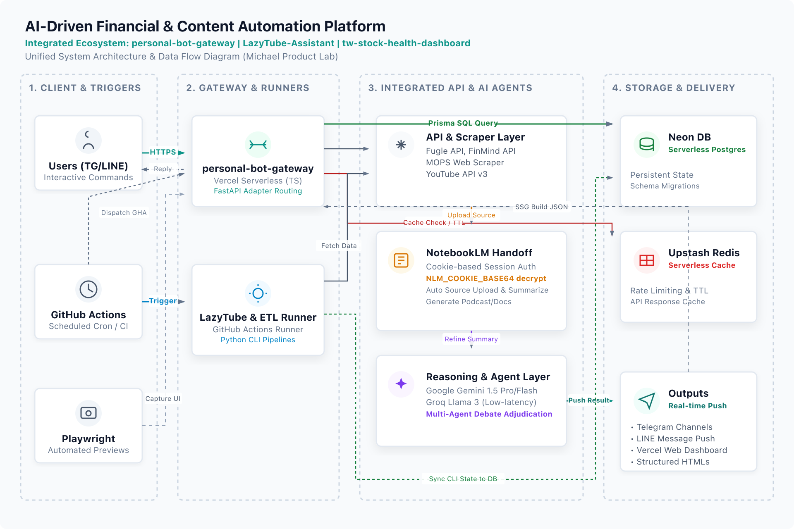
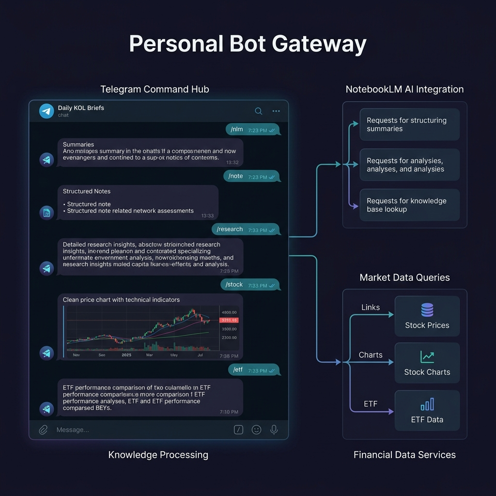
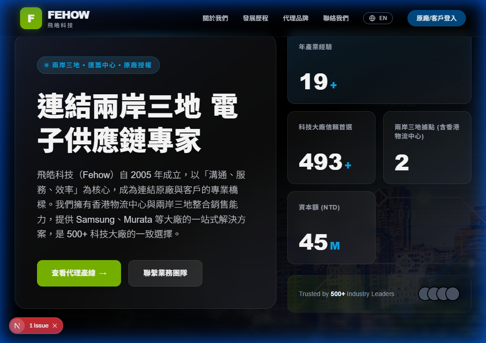

# Michael Product Lab

  English | <a href="README.zh-TW.md">繁體中文</a>

This project curates my public and private GitHub repositories into product cases. It moves beyond raw code lists to focus on the actual problems these tools solve.

I built this lab to help partners and managers quickly understand how I approach product development and system design, especially in finance, AI, and utility tools.

---

## System Architecture & Data Flow

The platform integrates a bot gateway, ETL schedulers, caching layers, and databases into a single automated pipeline:

*Note: This architecture diagram illustrates the integrated ecosystem formed by three independent repositories in this portfolio: `personal-bot-gateway`, `LazyTube-Assistant`, and `tw-stock-health-dashboard`.*

### Core technical implementation:
- **Asynchronous tasks & scheduling**: **GitHub Actions** runs cron jobs to trigger Python ETL scripts for YouTube and Fugle/FinMind API scraping. The pipeline decrypts `NLM_COOKIE_BASE64` to restore cookie sessions for uploading media to **NotebookLM**.
- **Caching & rate limits**: **Upstash Redis** buffers webhook spikes and enforces TTL rules and rate limiting to avoid exceeding third-party API quotas.
- **Database operations**: **Neon Serverless PostgreSQL** runs with Prisma/Drizzle for schema migrations. The database spins down to zero when idle and supports branching for sandbox testing.
- **Fail-safe & alerting**: Scrapers validate the HTML structure of targets like MOPS. Any unexpected changes trigger regex fallbacks and dispatch instant error notifications via a **Telegram Webhook**.

---

## Featured Product Spotlights

Four core projects selected to showcase key backgrounds and live execution views:

### 1. Personal Bot Gateway (personal-bot-gateway) [AI Automation]
* **Background**: Tracking daily KOLs, podcasts, news, and Threads posts scattered information across multiple applications. This bot aggregates Telegram commands, NotebookLM analysis, report link dispatch, and stock/ETF checks inside a single Telegram window.
* **Tech Highlights**: Built with Vercel Serverless (TS) API gateway. Integrates Redis cache to cut paid API costs by 75%, and automates NotebookLM cookie session handoff triggered by GitHub Actions.
* **Live View**:
  

### 2. Price Atlas (price-altas) [Data & Research]
* **Background**: Purchasing managers and e-commerce traders waste time manually searching items across multiple international sites (US/JP/TW) and calculating exchange rates, missing shipping overheads and dynamic price gaps.
* **Tech Highlights**: The FastAPI backend dispatches concurrent async scraping pipelines to Amazon US/JP, Yahoo JP, and Kakaku.com. It converts values to TWD via exchange-rate APIs and streams results using SSE (Server-Sent Events) with user-aborted request optimization. It uses `curl_cffi` to mimic Chrome TLS/JA3 fingerprints to bypass Cloudflare protection.
* **Live View**:
  *(Refer to the screenshots inside the web portfolio)*

### 3. Taiwan Stock Health Dashboard (tw-stock-health-dashboard) [Financial Intelligence]
* **Background**: Gathering index, global indices, and capital risk indicators manually is tedious and delays warnings on market liquidity flushes.
* **Tech Highlights**: Built an asynchronous ETL pipeline using concurrent Promise.all queries with Redis caching, and modeled crash warning flags.

### 4. Fehow Corporate Site (fehow-web) [Business Sites]
* **Background**: Electronics supply-chain companies need clean, credible websites to win trust from global buyers.
* **Tech Highlights**: Created an elegant Bento Grid layout that remains fully responsive using Next.js and CSS Grid. Implemented GSAP ScrollTrigger timelines for scroll-bound animations.
* **Live View**:
  

---

## All Projects &amp; Tech Matrix

To make it easy for interviewers to evaluate all repositories at a glance, here is a consolidated matrix of all 22 projects, their categories, core stack, integrations, and deployment status:

| Repository (Repo) | Product Line (Category) | Tech Stack | Integrations | Deployment |
| :--- | :--- | :--- | :--- | :--- |
| [personal-bot-gateway](https://github.com/michaelbothsieh-crypto/personal-bot-gateway) | AI Automation | TypeScript, FastAPI | Telegram/LINE Webhook, Neon DB, Upstash Redis, NotebookLM | [Vercel](https://personal-bot-gateway.vercel.app) (Private) |
| [LazyTube-Assistant](https://github.com/michaelbothsieh-crypto/LazyTube-Assistant) | AI Automation | Python | GitHub Actions, NotebookLM API, Telegram Bot, Neon DB | [Vercel](https://lazy-tube-assistant.vercel.app) |
| [tw-stock-health-dashboard](https://github.com/michaelbothsieh-crypto/tw-stock-health-dashboard) | Financial Intelligence | TypeScript, Next.js | GitHub Actions, Upstash Redis, Telegram Bot | [Vercel](https://tw-stock-health-dashboard.vercel.app) |
| [price-altas](https://github.com/michaelbothsieh-crypto/price-altas) | Data & Research | Python, FastAPI | Amazon/Yahoo APIs, Exchange Rate API, Upstash Redis | [Render](https://price-altas-frontend.vercel.app/) (Private) |
| [fortune-telling](https://github.com/michaelbothsieh-crypto/fortune-telling) | Experiments | TypeScript, React | Google Gemini AI API, PWA | [GitHub Pages](https://fortune-telling-sigma.vercel.app/) |
| [fehow-web](https://github.com/michaelbothsieh-crypto/fehow-web) | Business Sites | Next.js, Tailwind | GSAP ScrollTrigger, Bento Grid | [Vercel](https://m3-web-mauve.vercel.app) |
| [xiexing-pwa](https://github.com/michaelbothsieh-crypto/xiexing-pwa) | Business Sites | TypeScript, Next.js | Service Worker, PWA, Next-Gen Image Pipeline | Vercel (Local Preview) |
| [yellowstone-clinic](https://github.com/michaelbothsieh-crypto/yellowstone-clinic) | Business Sites | TypeScript, Next.js | PWA, WCAG Accessibility Guidelines | Vercel (Local Preview) |
| [insider-watch-bot](https://github.com/michaelbothsieh-crypto/insider-watch-bot) | Financial Intelligence | TypeScript | GitHub Actions, MOPS Scraper, Telegram Webhook | [GitHub](https://github.com/michaelbothsieh-crypto/insider-watch-bot) |
| [msg-converter](https://github.com/michaelbothsieh-crypto/msg-converter) | Product Utilities | HTML5, JavaScript | WebCrypto, OLE2 Binary Parser | GitHub Pages |
| [financial-news-analysis](https://github.com/michaelbothsieh-crypto/financial-news-analysis) | Financial Intelligence | Streamlit, Python | OpenAI GPT API, Streamlit Cloud | [Render](https://github.com/michaelbothsieh-crypto/financial-news-analysis) (Private) |
| [taiwan-nhi-calculator](https://github.com/michaelbothsieh-crypto/taiwan-nhi-calculator) | Product Utilities | HTML5, JavaScript | Decimals Math Library, Unit Testing | GitHub Pages (Private) |
| [team-eats](https://github.com/michaelbothsieh-crypto/team-eats) | Product Utilities | TypeScript, React | WebSocket, LocalStorage, PWA | GitHub Pages (Private) |
| [socket-swiss-knife](https://github.com/michaelbothsieh-crypto/socket-swiss-knife) | Product Utilities | Python | MTF TCP Socket, Tauri/Electron, GUI | Desktop App (Private) |
| [warrant-screener-tw](https://github.com/michaelbothsieh-crypto/warrant-screener-tw) | Financial Intelligence | JavaScript, Python | Black-Scholes Greeks Engine, requestAnimationFrame | [Vercel](https://warrant-screener-tw.vercel.app) (Private) |
| [Config-Diff-Viewer](https://github.com/michaelbothsieh-crypto/Config-Diff-Viewer) | Product Utilities | TypeScript, React | Web Worker, Myer's Diff, Virtual Scroll | [Vercel](https://config-diff-viewer.vercel.app) |
| [PodScribe](https://github.com/michaelbothsieh-crypto/PodScribe) | AI Automation | TypeScript, Next.js | Gemini AI API, Whisper API, Mermaid Mindmap | [Vercel](https://podscribe-six.vercel.app) |
| [presale-radar](https://github.com/michaelbothsieh-crypto/presale-radar) | Data & Research | Python, Next.js | Leaflet Map, Pandas ETL Pipeline | [Vercel](https://presale-radar.vercel.app) (Private) |
| [neighbor-profiler](https://github.com/michaelbothsieh-crypto/neighbor-profiler) | Data & Research | TypeScript, React | JCIC Finance Registry, 3D Radar Charts | [Vercel](https://house-dun-one.vercel.app) (Private) |
| [FastAPI-project](https://github.com/michaelbothsieh-crypto/FastAPI-project) | Experiments | Python, FastAPI | Model Context Protocol (MCP), PydanticAI | Jupyter / Local Run (Private) |
| [digit_recognition](https://github.com/michaelbothsieh-crypto/digit_recognition) | Experiments | Python, FastAPI | Scikit-learn (MLP), OpenCV, HTML5 Canvas | [Render](https://github.com/michaelbothsieh-crypto/digit_recognition) (Private) |
| [AIA-Training-Viewer](https://github.com/michaelbothsieh-crypto/AIA-Training-Viewer) | Data & Research | Jupyter, Python | TFEvent Binary Parser, Recharts | [Vercel](https://aia-training-viewer.vercel.app) (Private) |

---

## Infrastructure and Operations

Behind these projects, the portfolio includes engineering automation:

### 1. Automated Preview Pipeline
- **Solution**: Uses Playwright to detect live URLs and capture screenshots automatically. It flags 404 pages and missing deployments to prevent broken images, generating clean fallbacks when no live URL is available.

### 2. Static Data Pipeline
- **Solution**: Uses the GitHub CLI to export metadata into static JSON files during the build phase. This enables static site generation (SSG) with zero runtime API calls, ensuring fast page load times.

### 3. Data Overrides
- **Solution**: Implements a `project-overrides.json` config layer. This allows curation of titles, categories, feature highlights, and problem descriptions without modifying original GitHub metadata.
