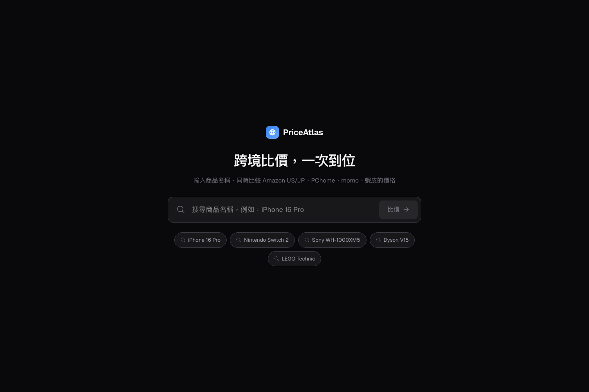
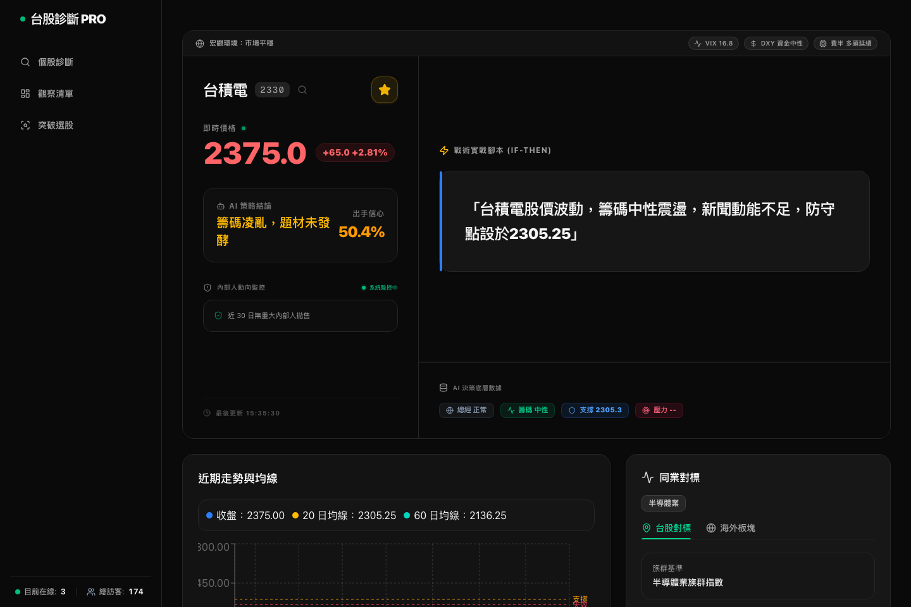
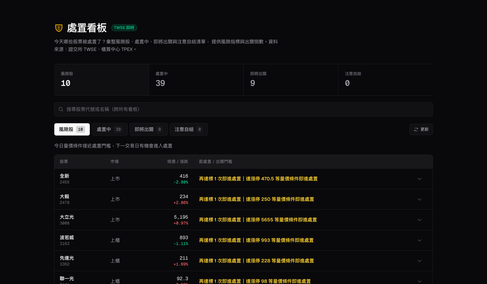
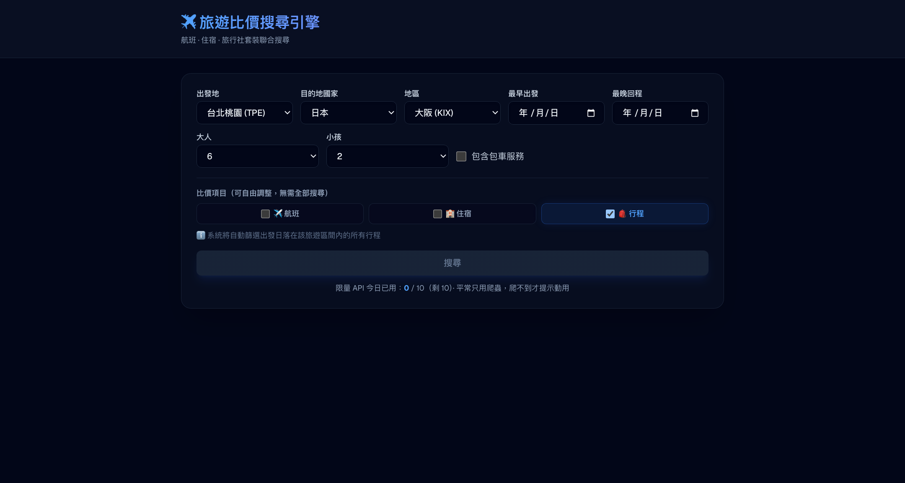

# Michael Product Lab (產品實驗室)

  <a href="README.md">English</a> | 繁體中文

這個專案把我開發的開源與私有專案整理成產品案例。這裡不只有程式碼，而是直接看這些工具解決了什麼實際問題。

建立這個實驗室，是為了讓合作夥伴或公司主管能快速了解我如何思考產品、如何設計系統架構，特別是在金融決策、AI 自動化與實用工具等領域。

---

## 核心技術架構與設計模式 (Core Technical Architecture & Design Patterns)

此作品集包含多個獨立的 AI 自動化與金融決策專案，它們各自解決了特定的日常痛點。以下為這些專案所採用的通用核心技術實作與設計重點：

### 技術實作與設計重點：
- **非同步任務與排程執行**：由 **GitHub Actions** 跑排程觸發 Python ETL，抓取 YouTube API 以及 Fugle/FinMind 的台股報價，接著用 `NLM_COOKIE_BASE64` 仿真 cookie session 將影音上傳到 **NotebookLM** 完成語音轉文字與摘要。
- **快取與 API 配額限制**：為防止 Webhook 流量暴增或重覆爬取導致 API 額度超支，使用 **Upstash Redis** 作為快取層，實作 TTL 緩衝與 Rate Limiting。
- **資料庫持久化**：採用 **Neon Serverless PostgreSQL** 搭配 Drizzle/Prisma 做 Schema 遷移，利用 scale-to-zero 節省閒置成本，並透過資料庫分支 (Branching) 功能開闢獨立的測試環境。
- **容錯與警報機制**：爬蟲偵測到 MOPS 網頁結構變更時會觸發 Regex 容錯，並立刻透過 **Telegram Webhook** 推送警報通知，避免排程任務默默失敗。

---

## 精選產品亮點 (Featured Product Spotlights)

這裡精選了幾個核心專案，並附上開發初衷與實際運行畫面：

### 1. Personal Bot Gateway (personal-bot-gateway) [AI 自動化]
* **設計初衷**：每天追蹤 KOL、Podcast、個股、ETF 等資訊入口太分散，資訊難以系統化整理。這款 Bot 將 TG 指令輸入、NotebookLM 分析、報告連結與市場行情回覆集中在同一個 Telegram 對話框中。
* **技術亮點**：套用最初以 `kol-daily-brief` 原型打造的核心語意處理與 NotebookLM 串接邏輯。使用 Vercel Serverless (TS) 實作 API 網關，並利用 Redis 快取降低 75% API 成本，整合 GitHub Actions 觸發與 NotebookLM 仿真 Session 登入。
* **實際畫面**：
  

### 2. Price Atlas (price-altas) [資料研究]
* **設計初衷**：採購與跨境商家在比對各國商品價格時，必須開啟多個分頁查詢並手動換算匯率。此工具一鍵併發向台、美、日主流平台查價並自動折算即時匯率。
* **技術亮點**：後端採用 FastAPI 協同 Python 異步爬蟲，以 SSE (Server-Sent Events) 串流技術即時回傳比價結果。使用 `curl_cffi` 偽裝 Chrome TLS/JA3 指紋以繞過 WAF 防爬限制。
* **實際畫面**：
  

### 3. 台股健康儀表板 (tw-stock-health-dashboard) [金融決策]
* **設計初衷**：投資人每日需手動收集台股大盤、融資券與海外風險指標，流程繁瑣且不易早期察覺市場籌碼崩盤訊號。
* **技術亮點**：設計非同步 ETL Pipeline，利用 Promise.all 併發抓取並在 Redis 中進行快取，並透過簡單神經網絡進行崩盤預警因子的加權估算。
* **實際畫面**：
  

### 4. 處置看板 (disposal-board) [金融決策]
* **設計初衷**：台股處置／注意股資訊散落於證交所與櫃買中心公告、且不支援瀏覽器跨域，投資人難以一眼掌握個股的風險狀態。
* **技術亮點**：以 Next.js Route Handler 在 server 端併行抓取 TWSE/TPEX OpenAPI 與 Yahoo 報價，透過市場無關的純函式引擎依「處置作業要點」（連 3 次／10 日 6 次／30 日 12 次）計算風險分數、漲跌停價與出關倒數。名單以「處置日」為鍵（台北 18:00 換日）一天只抓一次，即時報價 20 秒新鮮度。
* **實際畫面**：
  

### 5. 旅遊比價引擎 (travel) [工具產品]
* **設計初衷**：為台灣出發的旅客比較機票、飯店與套裝行程要在多個零散來源間來回切換，而且每次查詢的 API 成本會快速累積。
* **技術亮點**：採「爬蟲優先、限量 API 為輔」的雙軌架構——機票／飯店／行程以 `Promise.allSettled` 併行抓取，結果於 Upstash Redis 做當日快取（相同查詢 <100ms），爬蟲落空時才由使用者手動觸發 SerpAPI 後備（每日 10 次）。GitHub Actions 每日暖快取。
* **實際畫面**：
  

### 6. 飛皓科技形象網站 (fehow-web) [企業網站]
* **設計初衷**：電子供應鏈企業需要具備國際公信力的官方網站，以向海外客戶呈現技術與供應實力。
* **技術亮點**：採用 Next.js + CSS Grid 打造 Bento Grid 響應式佈局，並優化 GSAP 滾動動畫在行動端的流暢度。
* **實際畫面**：
  

---

## 全部專案與技術矩陣 (All Projects &amp; Tech Matrix)

<!-- AUTO:projects -->
以下為全部 30 個進行中專案的矩陣，由 GitHub 即時資料自動產生，不會再過時。

| 專案 | 產品線 | 技術 | 亮點 | 連結 |
| :--- | :--- | :--- | :--- | :--- |
| [personal-bot-gateway](https://github.com/michaelbothsieh-crypto/personal-bot-gateway) | AI 自動化 | TypeScript | Telegram 指令中樞 · KOL 每日掃描與單日範例簡報 · NotebookLM 完整報告連結 | [Demo](https://personal-bot-gateway.vercel.app) · [GitHub](https://github.com/michaelbothsieh-crypto/personal-bot-gateway) · 🔒 |
| [tw-stock-health-dashboard](https://github.com/michaelbothsieh-crypto/tw-stock-health-dashboard) | 金融決策 | TypeScript | 盤後摘要 · 海外連動 · 崩盤預警 | [Demo](https://tw-stock-health-dashboard.vercel.app) · [GitHub](https://github.com/michaelbothsieh-crypto/tw-stock-health-dashboard) |
| [kol-daily-brief](https://github.com/michaelbothsieh-crypto/kol-daily-brief) | AI 自動化 | Python | 每日 KOL 簡報展示 · YouTube API · NotebookLM 摘要 | [Demo](https://kol-daily-brief.vercel.app) · [GitHub](https://github.com/michaelbothsieh-crypto/kol-daily-brief) |
| [price-altas](https://github.com/michaelbothsieh-crypto/price-altas) | 資料研究 | Python | 多國主流平台（台美日）一次性搜尋 · 即時匯率轉換 (Exchange Rate API) · SSE (Server-Sent Events) 串流比價 | [Demo](https://price-altas-frontend.vercel.app/) · [GitHub](https://github.com/michaelbothsieh-crypto/price-altas) · 🔒 |
| [travel](https://github.com/michaelbothsieh-crypto/travel) | 工具產品 | TypeScript | 機票/飯店/行程併行比價 · 爬蟲優先零 API 成本 · 當日快取 <100ms | [Demo](https://travel-compare-tw.vercel.app) · [GitHub](https://github.com/michaelbothsieh-crypto/travel) · 🔒 |
| [fehow-web](https://github.com/michaelbothsieh-crypto/fehow-web) | 企業網站 | TypeScript | 企業形象 · Bento Grid · 供應鏈敘事 | [Demo](https://m3-web-mauve.vercel.app) · [GitHub](https://github.com/michaelbothsieh-crypto/fehow-web) |
| [PodScribe](https://github.com/michaelbothsieh-crypto/PodScribe) | AI 自動化 | TypeScript | Podcast 轉錄 · Gemini 分析 · 心智圖 | [Demo](https://podscribe-six.vercel.app) · [GitHub](https://github.com/michaelbothsieh-crypto/PodScribe) |
| [Config-Diff-Viewer](https://github.com/michaelbothsieh-crypto/Config-Diff-Viewer) | 工具產品 | TypeScript | 目錄比對 · 差異視覺化 · 設定審查 | [Demo](https://config-diff-viewer.vercel.app) · [GitHub](https://github.com/michaelbothsieh-crypto/Config-Diff-Viewer) |
| [disposal-board](https://github.com/michaelbothsieh-crypto/disposal-board) | 金融決策 | TypeScript | 四大風險看板 · TWSE/TPEX 真實資料 · 出關倒數與未來腳本 | [Demo](https://disposal-board.vercel.app) · [GitHub](https://github.com/michaelbothsieh-crypto/disposal-board) · 🔒 |
| [warrant-screener-tw](https://github.com/michaelbothsieh-crypto/warrant-screener-tw) | 金融決策 | JavaScript | 條件篩選 · 標的比較 · 即時部署 | [Demo](https://warrant-screener-tw.vercel.app) · [GitHub](https://github.com/michaelbothsieh-crypto/warrant-screener-tw) · 🔒 |
| [insider-watch-bot](https://github.com/michaelbothsieh-crypto/insider-watch-bot) | 金融決策 | TypeScript | MOPS 監控 · 提前警示 · 籌碼分析 | [GitHub](https://github.com/michaelbothsieh-crypto/insider-watch-bot) |
| [poe-price-tracker](https://github.com/michaelbothsieh-crypto/poe-price-tracker) | 資料研究 | TypeScript | POB 資料解析 · 裝備價值演算 · 即時價格監控 | [Demo](https://poe-price-tracker.vercel.app) · [GitHub](https://github.com/michaelbothsieh-crypto/poe-price-tracker) · 🔒 |
| [presale-radar](https://github.com/michaelbothsieh-crypto/presale-radar) | 資料研究 | Python | 資料整理 · 區域觀察 · 市場雷達 | [Demo](https://presale-radar.vercel.app) · [GitHub](https://github.com/michaelbothsieh-crypto/presale-radar) · 🔒 |
| [faceless_hunter](https://github.com/michaelbothsieh-crypto/faceless_hunter) | AI 自動化 | JavaScript | YouTube 分析 · 爆紅比例 · 題材探索 | [Demo](https://faceless-hunter.vercel.app/) · [GitHub](https://github.com/michaelbothsieh-crypto/faceless_hunter) · 🔒 |
| [xiexing-pwa](https://github.com/michaelbothsieh-crypto/xiexing-pwa) | 企業網站 | TypeScript | 服務展示 · PWA · 商務導流 | [GitHub](https://github.com/michaelbothsieh-crypto/xiexing-pwa) |
| [yellowstone-clinic](https://github.com/michaelbothsieh-crypto/yellowstone-clinic) | 企業網站 | TypeScript | 診所資訊 · 服務介紹 · PWA | [GitHub](https://github.com/michaelbothsieh-crypto/yellowstone-clinic) |
| [neighbor-profiler](https://github.com/michaelbothsieh-crypto/neighbor-profiler) | 資料研究 | TypeScript | 估值落差 · 路段分析 · 風險提示 | [Demo](https://house-dun-one.vercel.app) · [GitHub](https://github.com/michaelbothsieh-crypto/neighbor-profiler) · 🔒 |
| [socket-swiss-knife](https://github.com/michaelbothsieh-crypto/socket-swiss-knife) | 工具產品 | Python | 券商設定 · 定時測試 · 桌面 GUI | [GitHub](https://github.com/michaelbothsieh-crypto/socket-swiss-knife) · 🔒 |
| [fortune-telling](https://github.com/michaelbothsieh-crypto/fortune-telling) | 實驗原型 | TypeScript | 八字分析 · AI 解讀 · PWA 體驗 | [Demo](https://fortune-telling-sigma.vercel.app/) · [GitHub](https://github.com/michaelbothsieh-crypto/fortune-telling) |
| [financial-news-analysis](https://github.com/michaelbothsieh-crypto/financial-news-analysis) | 金融決策 | HTML | 新聞擷取 · 情緒分析 · 策略摘要 | [GitHub](https://github.com/michaelbothsieh-crypto/financial-news-analysis) · 🔒 |
| [smc-trinity-ai](https://github.com/michaelbothsieh-crypto/smc-trinity-ai) | 金融決策 | Python | SMC 分析 · 多代理人辯論 · 交易裁決 | [GitHub](https://github.com/michaelbothsieh-crypto/smc-trinity-ai) · 🔒 |
| [broker-credential-dashboard](https://github.com/michaelbothsieh-crypto/broker-credential-dashboard) | 工具產品 | PHP | 帳密管理 · 狀態監控 · 輕量工具 | [GitHub](https://github.com/michaelbothsieh-crypto/broker-credential-dashboard) · 🔒 |
| [team-eats](https://github.com/michaelbothsieh-crypto/team-eats) | 工具產品 | TypeScript | 投票 · 揪團統計 · 費用紀錄 | [GitHub](https://github.com/michaelbothsieh-crypto/team-eats) · 🔒 |
| [msg-converter](https://github.com/michaelbothsieh-crypto/msg-converter) | 工具產品 | HTML | MSG 解析 · HTML 輸出 · 附件處理 | [GitHub](https://github.com/michaelbothsieh-crypto/msg-converter) |
| [taiwan-nhi-calculator](https://github.com/michaelbothsieh-crypto/taiwan-nhi-calculator) | 工具產品 | HTML | 保費試算 · 身份情境 · 表單工具 | [GitHub](https://github.com/michaelbothsieh-crypto/taiwan-nhi-calculator) · 🔒 |
| [north-volley-guide](https://github.com/michaelbothsieh-crypto/north-volley-guide) | 實驗原型 | TypeScript | 場地整理 · 快速查找 · 行動瀏覽 | [Demo](https://north-volley-guide.vercel.app) · [GitHub](https://github.com/michaelbothsieh-crypto/north-volley-guide) · 🔒 |
| [golf-strategy-lk-prototype](https://github.com/michaelbothsieh-crypto/golf-strategy-lk-prototype) | 工具產品 | JavaScript | 資料展示 · 球道攻略 · 靜態原型 | [Demo](https://golf-strategy-lk-prototype.vercel.app) · [GitHub](https://github.com/michaelbothsieh-crypto/golf-strategy-lk-prototype) · 🔒 |
| [AIA-Training-Viewer](https://github.com/michaelbothsieh-crypto/AIA-Training-Viewer) | 資料研究 | Jupyter Notebook | 課程導航 · 資源共享 · 精美卡片 | [Demo](https://aia-training-viewer.vercel.app) · [GitHub](https://github.com/michaelbothsieh-crypto/AIA-Training-Viewer) · 🔒 |
| [digit_recognition](https://github.com/michaelbothsieh-crypto/digit_recognition) | 實驗原型 | Python | 即時繪圖 · 影像前處理 · MLP 模型 | [GitHub](https://github.com/michaelbothsieh-crypto/digit_recognition) · 🔒 |
| [FastAPI-project](https://github.com/michaelbothsieh-crypto/FastAPI-project) | 實驗原型 | Jupyter Notebook | FastAPI · PydanticAI · 串流對話 | [GitHub](https://github.com/michaelbothsieh-crypto/FastAPI-project) · 🔒 |
<!-- /AUTO:projects -->

---

## 產品研發與自動化維運

除了產品本身，這個實驗室的基礎設施也展示了我的工程自動化能力：

### 1. 每日 Repo 同步 (GitHub Actions)
- **解決方案**：排程 workflow（`.github/workflows/sync-repos.yml`）每日跑 `gh repo list`，更新 `repos.generated.json` 內所有 repo 與其最後更新時間，只有在內容變動時才提交。並加上防呆：若抓到 0 個私有 repo（多半是 token 權限不足）會直接中止，避免壞憑證把清單覆寫成只剩公開 repo 的殘缺版本。

### 2. 自動產生的專案矩陣 (Auto-generated Matrix)
- **解決方案**：同一個同步步驟會在兩份 README 的 `AUTO:projects` 標記之間重新產生「全部專案」表格，把 GitHub 即時資料與精修過的分類、亮點合併輸出。新增 repo 會自動出現——矩陣永遠不會過時。

### 3. 靜態資料管線 (Static Data Pipeline)
- **解決方案**：在同步階段將 GitHub 專案資訊匯出為靜態 JSON，實現零 API 呼叫的靜態網頁生成（SSG），提升網頁載入速度。

### 4. 預覽圖清單機制 (Curated Preview Manifest)
- **解決方案**：以 `preview-manifest.generated.json` 將每個 repo 對應到實際網站截圖或乾淨的備用圖，即使是私有或尚未部署的專案，也不會出現破圖。

### 5. 多維度資料覆寫機制 (Data Overrides)
- **解決方案**：以 `project-overrides.json` 覆寫層，在不改動 GitHub 原始資料的情況下補充各專案的分類、中英文敘述、痛點分析與精選排序。
